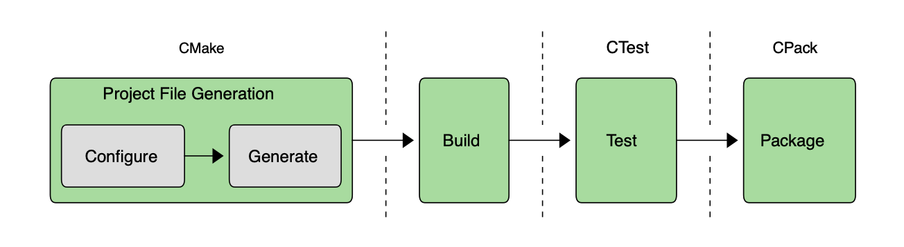

# Introduction

**Problem:**
Creating build system for multi platform applications drives to complexity.

**Solution:**
Cmake make the process more manageble.

Cmake:
- it is suite of tools which covers everything from *setting up a build* right through to *producing packages* ready for distribution.
- it supports a wide range of platforms, tools and languages.

