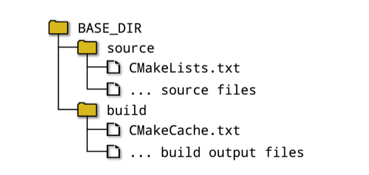

CMakeLists.txt 
- it defines what should be built and how, what tests to run and what package(s) to create.
- it is a platform-independent description of the whole project

A project have both:
- a source directory: 
  where the CMakeLists.txt file is located and the project’s source files and all other files needed for the build are organized 
- a binary directory. 


Where do you want your build directory to be in relation to your source directory ?
Two approach:
## 2.1 - in-source builds:
    - the source and build directories are the same.
    - non- trivial to clear out all build output.
    - Dicouraged.
## 2.2 - out-of-sources builds
    - the source and build directories are different.
    - developer can create multiple build directories for the same source directory.
    - Preferable.



## 2.3 - Genrating Project files:
- select the type of project file to be generated == choose a generator

Generators: Visual Studio, Xcode, Ninja, Makefiles.
configurations: Release, Debug, etc.

Some generators support multiple configuration.

Generator supporting multiple configuration:
You can choose between different build configurations without having to re-run CMake.
ex: Ninja multi-config,


Generator not supporting multiple configuration:
You have to re-run CMake to switch the build between Debug, Release, etc
ex: Ninja, Unix Makefiles, * Makefiles.

The most basic way to run CMake:
```sh
mkdir build
cd build
cmake -G "Unix Makfiles" ../build
```
- -G omitted => CMake will choose a default generator type based on the host platform.
- Override the default host platform generator: set CMAKE_GENERATOR environment variable to the desired default ?

What the command does:
- carry out a series of tests to determine how to set up the project files.
- verifying that the compilers work
- determining the set of supported compiler feature
- ...

output logs:
```sh
  -- Configuring done
  -- Generating done
  -- Build files have been written to: /some/path/build
```

project file creation involves two steps:
- configuring phase: 
  CMake reads in the CMakeLists.txt file and builds up an internal representation of the entire project.
- generating phase:
  CMake creates the project files

## 2.4 - Running The Build Tool

- With project files available, the developer can use their selected build tool in the way to which they are accustomed.
  ```sh
  #if generator was Make
  make
  #if generator was Ninja
  ninja --build
  ```
- cmake can invoke the build tool on the developer’s behalf 
  ```sh
  cmake --build /pathTo/build --config Debug --target Myapp
  ```
  - --build option points to the build directory used by the CMake project generation step.
  - the --config option: for multi configuration generators, specifies which configuration to build. ignored for singe configuration generators.
  -  --target option: used to tell the build tool what to build. list of space separated.

invoking build tool via the cmake command:
```sh
mkdir build
cd build
cmake -G "Unix Makefiles" ../source
cmake --build . --config Release --target Myapp
```

## 2.5 - Recommended practices
- Make a habit of keeping the build directory completely separate from the source tree. 
- set up two or more different builds for the same source directory. Release, Debug, etc.
- Use different project generators for the different build directories. Ninja, Unix Makefiles, etc.
- Don't be focused on using one particular type of project generator in the early stages of a project.
- Periodically check the build with a different project generator.